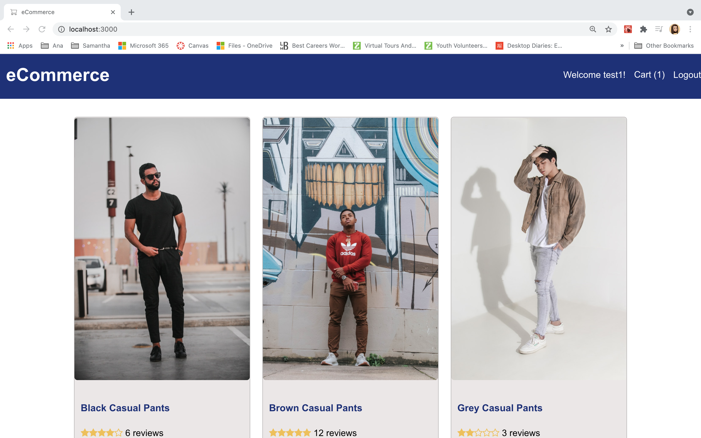

# E-Commerce

## Table Of Contents:
- [Description](#Description)
- [Deployment](#Deployment)
- [Installation](#Installation)
- [License](#License)

## Description

An application that will allow any retail store, regardless of size, the ability to provide an online experience for consumers regardless of the current situation or possible future pandemic, you too can stay in the game. Having seen so many small retail stores close when quarantine began, my focus was driven to attempt to provide a flexible, low cost, self-manageable e-Commerce Product.

## Deployment: 

GitHub Repo: https://github.com/al-moreno/MERN-eCommerce 

Heroku: pending

## Installation:
1.  After cloning repo to your device locate the folder
2.  In terminal run "npm i" which will install all the required dependencies 
3.  In terminal command line run "npm start"

## License
MIT License

Copyright (c) 

Permission is hereby granted, free of charge, to any person obtaining a copy of this software and associated documentation files (the "Software"), to deal in the Software without restriction, including without limitation the rights to use, copy, modify, merge, publish, distribute, sublicense, and/or sell copies of the Software, and to permit persons to whom the Software is furnished to do so, subject to the following conditions:

The above copyright notice and this permission notice shall be included in all copies or substantial portions of the Software.

THE SOFTWARE IS PROVIDED "AS IS", WITHOUT WARRANTY OF ANY KIND, EXPRESS OR IMPLIED, INCLUDING BUT NOT LIMITED TO THE WARRANTIES OF MERCHANTABILITY, FITNESS FOR A PARTICULAR PURPOSE AND NONINFRINGEMENT. IN NO EVENT SHALL THE AUTHORS OR COPYRIGHT HOLDERS BE LIABLE FOR ANY CLAIM, DAMAGES OR OTHER LIABILITY, WHETHER IN AN ACTION OF CONTRACT, TORT OR OTHERWISE, ARISING FROM, OUT OF OR IN CONNECTION WITH THE SOFTWARE OR THE USE OR OTHER DEALINGS IN THE SOFTWARE.
 -->
